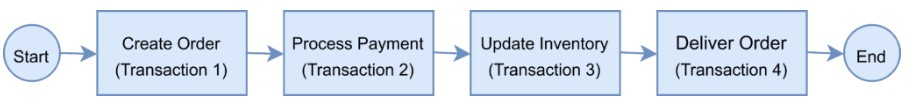
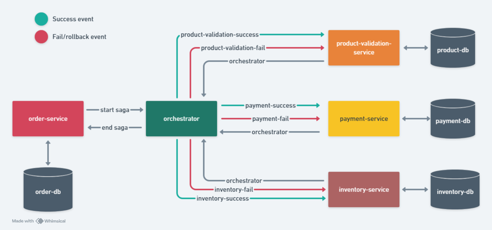
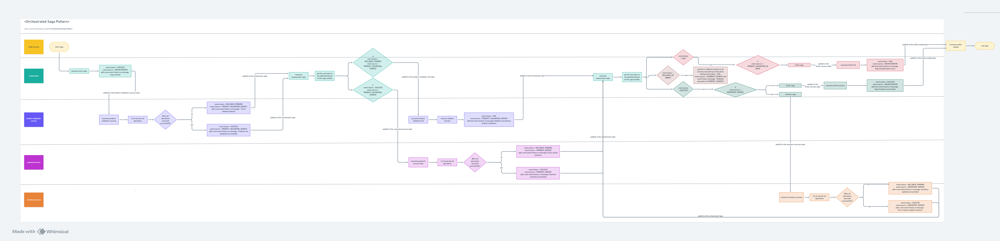
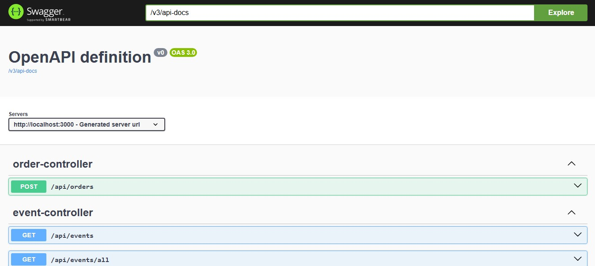

<div align="center">


<a href="/README-pt-br.md">
  
</a>

</div>

<div align="center">
  
  
  
  
  
  
</div>

---

# Order System

This repository contains the project code developed during the course ["Arquitetura de Microsserviços: Padrão Saga Orquestrado"](https://www.udemy.com/course/arquitetura-de-microsservicos-padrao-saga-orquestrado/) on Udemy.

For study purposes, to explore microservices architecture patterns and ways to handle **distributed transactions** and **data consistency**, an order system was developed using the **Orchestrated Saga Pattern with Java 17 and Spring Boot 3**.


(Example of a distributed transaction in an order system. Source: [Baeldung](https://www.baeldung.com/wp-content/uploads/sites/4/2021/04/distributed-transaction.png))

## What is Saga pattern?

The Saga pattern aims to ensure that, in case of a failure in the flow of a distributed transaction, all changes are undone in the order they were performed. It can be implemented using two distinct approaches: Orchestrated and Choreographed.

**Choreographed Saga Pattern**: Each microservice involved in the transaction publishes an event that is processed by the next microservice.

**Orchestrated Saga Pattern (Used in this project)**: A single orchestrator is responsible for managing the overall status of the transaction.

</br>

## 🕹 Navigation

- [Features](#-features)
- [Project Structure](#-project-structure)
- [System Architecture](#-system-architecture)
- [Technologies Used](#-technologies-used)
- [Requirements](#-requirements)
- [Installation Guide](#-installation-guide)
- [Endpoints](#-endpoints)
- [Topics](#-topics)
- [Contact](#-contact)

</br>

## ⚙️ Features

- Order generation;
- Validation of products included in an order;
- Simulation of order payments;
- Validation of product availability and inventory deduction for the order;
- Idempotency: The system prevents publishing events with an existing `orderId` or `transactionId`. This ensures that the same event is not processed more than once.

</br>

# 🧩 Project Structure

- `order-service`: microservice responsible only for generating an initial order and receiving notifications. This service exposes REST endpoints to start the process and retrieve event data. The database used is MongoDB.

- `orchestrator-service`: microservice responsible for orchestrating the entire Saga execution flow. It tracks which microservice has been executed, its current state, and determines the next service to trigger. It also stores event process data. This service does not use a database.

- `product-validation-service`: microservice responsible for validating whether the products included in an order exist and are valid. It stores product validation data associated with an order ID. The database used is PostgreSQL.

- `payment-service`: microservice responsible for processing payments based on the unit prices and quantities specified in the order. It stores payment information for each order. The database used is PostgreSQL.

- `inventory-service`: microservice responsible for updating (deducting) product stock quantities for an order. It stores stock deduction information associated with an order ID. The database used is PostgreSQL.

- `docs`: this folder contains assets used in the README.md documentation, such as images.

</br>

# 🧠 System Architecture


## Flowchart


- Access the flowchart [here](https://whimsical.com/order-system-fluxogram-LUyp7k8U2xNJmfnW6jPcup)

</br>

# 🛠️ Technologies Used
* **Java 17**: A high-level, object-oriented programming language widely used for building server-side applications, web services, and Android applications.

* **Spring Boot 3**: A framework that simplifies the development of Java applications by providing built-in features for dependency injection, configuration, and microservices support.

* **Apache Kafka**: An open-source distributed streaming platform that acts as a message broker, enabling the publishing, subscribing, storing, and processing of real-time data streams in a scalable and fault-tolerant way.

* **Swagger UI**: An open-source tool that generates interactive API documentation from an OpenAPI specification, enabling developers to visualize, explore, and test endpoints directly in the browser.

* **Redpanda Console**: An open-source web-based user interface for managing and monitoring Kafka or Redpanda clusters, providing real-time insights into topics, consumer groups, and messages. It simplifies debugging, inspecting message payloads, and observing system health through an intuitive and interactive dashboard.

* **Jakarta Bean Validation**: A standard framework for declaring and validating constraints on Java objects using annotations, commonly used to enforce business rules and input validation in a clean and declarative way.

* **JPA**: The Java Persistence API, a specification that provides object-relational mapping (ORM) to manage relational data in Java applications.

* **Lombok**: A Java library that reduces boilerplate code by generating common methods like getters, setters, constructors, and more through annotations.

## Databases  & Tools
* **MongoDB**: A NoSQL database designed for high performance, scalability, and flexibility, storing data in JSON-like documents.

* **PostgreSQL**: A powerful open-source relational database management system, known for its reliability, extensibility, and SQL compliance.

* **Docker**: A platform that allows developers to automate the deployment of applications inside lightweight containers, ensuring consistency across different environments and simplifying the setup process.

</br>

# 🧰 Requirements

To run the project, the following tools must be installed and properly configured:

- Docker
- Git

</br>

# 🚀 Installation Guide

1. **Clone the repository**

```bash
git clone https://github.com/ABeatrizSC/order-system.git
```

2. **Navigate to the directory**

```bash
cd order-system
```

3. **Build and run containers**

```bash
docker-compose up --build
```

</br>

# 🔗 Endpoints

- You can access and test all endpoints directly from the browser through the Swagger URL: [http://localhost:3000/swagger-ui.html](http://localhost:3000/swagger-ui.html)



## 1. ORDER-SERVICE

- Microservice responsible for generating a new order

### **POST** `/api/orders`

- Creates a new order and visualize events

#### Request Body
- `OrderRequest`

```json
{
  "products": [
    {
      "product": {
        "code": "COMIC_BOOKS", //ENUM = [COMIC_BOOKS, BOOKS, MOVIES, MUSIC]
        "unitValue": 15.50
      },
      "quantity": 3
    },
    {
      "product": {
        "code": "BOOKS",
        "unitValue": 9.90
      },
      "quantity": 1
    }
  ]
}
```

#### Success Response
- `Order`

```json
{
  "id": "64429e987a8b646915b3735f",
  "products": [
    {
      "product": {
        "code": "COMIC_BOOKS",
        "unitValue": 15.5
      },
      "quantity": 3
    },
    {
      "product": {
        "code": "BOOKS",
        "unitValue": 9.9
      },
      "quantity": 1
    }
  ],
  "createdAt": "2023-04-21T14:32:56.335943085",
  "transactionId": "1682087576536_99d2ca6c-f074-41a6-92e0-21700148b519"
}
```

</br>

### **GET** `/api/events/all`

- Returns information about all events in the saga

#### Success Response
- `List<Event>`

```json
[
    {
        "id": "64429e9a7a8b646915b37360",
        "transactionId": "1682087576536_99d2ca6c-f074-41a6-92e0-21700148b519",
        "orderId": "64429e987a8b646915b3735f",
        "payload": {
            "id": "64429e987a8b646915b3735f",
            "products": [
                {
                    "product": {
                        "code": "COMIC_BOOKS",
                        "unitValue": 15.5
                    },
                    "quantity": 3
                },
                {
                    "product": {
                        "code": "BOOKS",
                        "unitValue": 9.9
                    },
                    "quantity": 1
                }
            ],
            "totalAmount": 56.40,
            "totalItems": 4,
            "createdAt": "2023-04-21T14:32:56.335943085",
            "transactionId": "1682087576536_99d2ca6c-f074-41a6-92e0-21700148b519"
        },
        "source": "ORCHESTRATOR",
        "status": "SUCCESS",
        "eventHistory": [
            {
                "source": "ORCHESTRATOR",
                "status": "SUCCESS",
                "message": "Saga started!",
                "createdAt": "2023-04-21T14:32:56.78770516"
            },
            {
                "source": "PRODUCT_VALIDATION_SERVICE",
                "status": "SUCCESS",
                "message": "Products are validated successfully!",
                "createdAt": "2023-04-21T14:32:57.169378616"
            },
            {
                "source": "PAYMENT_SERVICE",
                "status": "SUCCESS",
                "message": "Payment realized successfully!",
                "createdAt": "2023-04-21T14:32:57.617624655"
            },
            {
                "source": "INVENTORY_SERVICE",
                "status": "SUCCESS",
                "message": "Inventory updated successfully!",
                "createdAt": "2023-04-21T14:32:58.139176809"
            },
            {
                "source": "ORCHESTRATOR",
                "status": "SUCCESS",
                "message": "Saga finished successfully!",
                "createdAt": "2023-04-21T14:32:58.248630293"
            }
        ],
        "createdAt": "2023-04-21T14:32:58.28"
    },
    // ...
]
```

</br>

### **GET** `/api/events?orderId={id}`
### **GET** `/api/events?transactionId={id}`

- Retrieves specific data from a saga event by its `orderId` or `transactionId`:

#### Success Response
- `Event`

```json
{
    "id": "64429e9a7a8b646915b37360",
    "transactionId": "1682087576536_99d2ca6c-f074-41a6-92e0-21700148b519",
    "orderId": "64429e987a8b646915b3735f",
    "payload": {
        "id": "64429e987a8b646915b3735f",
        "products": [
            {
              "product": {
                  "code": "COMIC_BOOKS",
                  "unitValue": 15.5
              },
              "quantity": 3
            },
            {
              "product": {
                  "code": "BOOKS",
                  "unitValue": 9.9
              },
              "quantity": 1
            }
        ],
        "totalAmount": 56.40,
        "totalItems": 4,
        "createdAt": "2023-04-21T14:32:56.335943085",
        "transactionId": "1682087576536_99d2ca6c-f074-41a6-92e0-21700148b519"
    },
    "source": "ORCHESTRATOR",
    "status": "SUCCESS",
    "eventHistory": [
        {
            "source": "ORCHESTRATOR",
            "status": "SUCCESS",
            "message": "Saga started!",
            "createdAt": "2023-04-21T14:32:56.78770516"
        },
        {
            "source": "PRODUCT_VALIDATION_SERVICE",
            "status": "SUCCESS",
            "message": "Products are validated successfully!",
            "createdAt": "2023-04-21T14:32:57.169378616"
        },
        {
            "source": "PAYMENT_SERVICE",
            "status": "SUCCESS",
            "message": "Payment realized successfully!",
            "createdAt": "2023-04-21T14:32:57.617624655"
        },
        {
            "source": "INVENTORY_SERVICE",
            "status": "SUCCESS",
            "message": "Inventory updated successfully!",
            "createdAt": "2023-04-21T14:32:58.139176809"
        },
        {
            "source": "ORCHESTRATOR",
            "status": "SUCCESS",
            "message": "Saga finished successfully!",
            "createdAt": "2023-04-21T14:32:58.248630293"
        }
    ],
    "createdAt": "2023-04-21T14:32:58.28"
}
```

</br>

## Error Messages

All errors handled will follow this format:

```json
{
  "status": 400,
  "message": "Error description."
}
```

| Field     | Type    | Description               |
| --------- | ------- | ------------------------- |
| `status`  | Integer | HTTP status code          |
| `message` | String  | Descriptive message       |

</br>

# 📥 Topics
- You can also access the Redpanda Console to visualize all topics and publish new events in the system at [http://localhost:8081](http://localhost:8081) 


</br>

# 📞 Contact

- GitHub: [ABeatrizSC](https://github.com/ABeatrizSC)
- Linkedin: [Ana Beatriz Santucci Carmoni](www.linkedin.com/in/ana-carmoni)
- Email: [anabscarmoni@gmail.com](mailto:anabscarmoni@gmail.com)

</br>

---

</br>

**Course original repository:** [github.com/vhnegrisoli](https://github.com/vhnegrisoli/curso-udemy-microsservicos-padrao-saga-orquestrado/)
